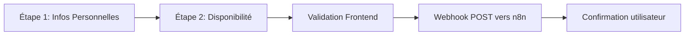
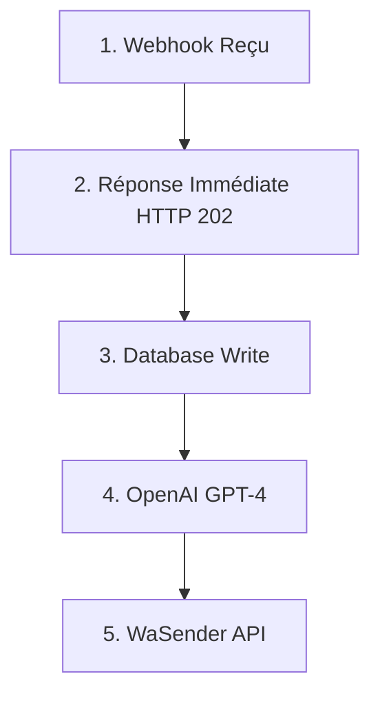
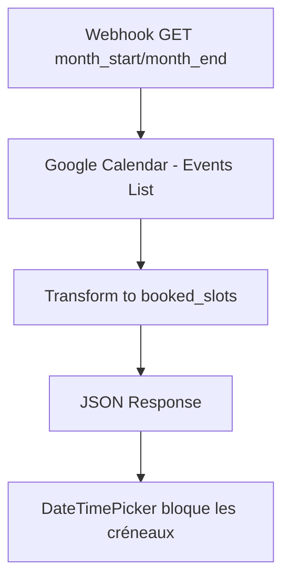
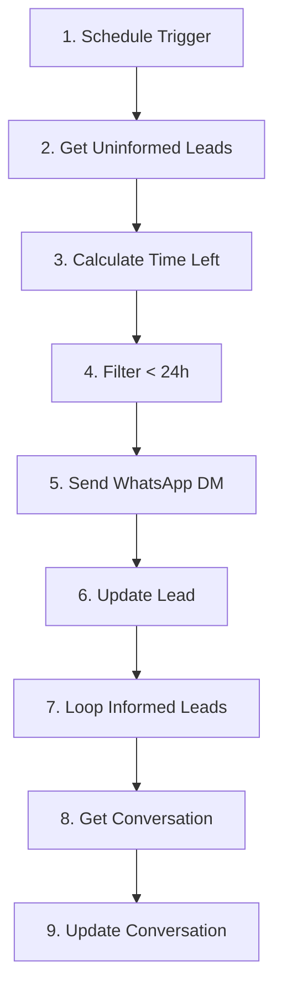
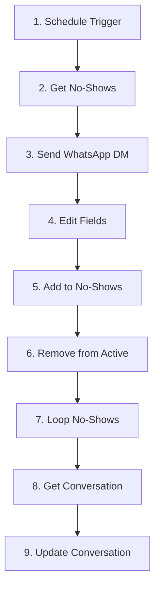
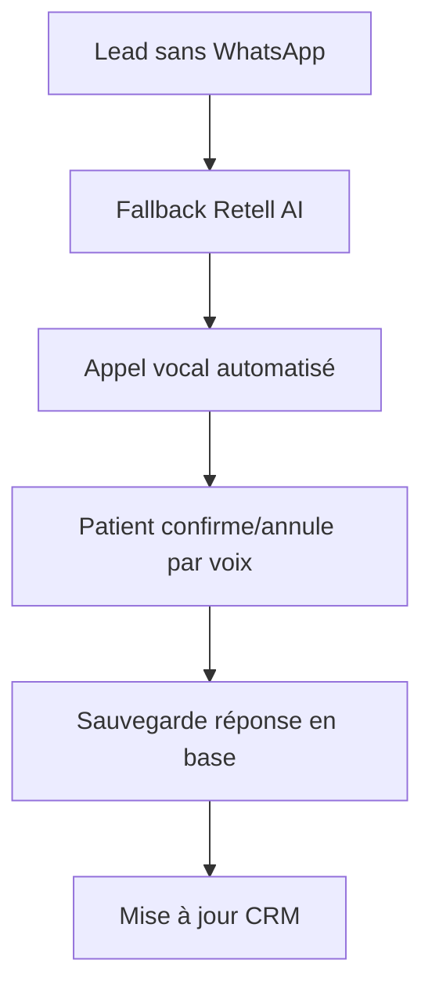

# DENTIRO — Stratégie & Blueprint de Workflow IA Réceptionniste

Ce README est la version documentation de la page **Stratégie** de l’application, avec les mêmes sections clés, captures de workflows et diagrammes.

---

## 1) Spécification du Projet

**Conception & Blueprint de Workflow d'Agent IA Réceptionniste Simplifié pour Clinique Dentaire**

### Objectif
Développer un blueprint détaillé pour un workflow automatisé capable de :
- Qualifier un nouveau lead venant d'un formulaire web (nom, tel, e-mail, besoin principal)
- Envoyer un rappel de RDV personnalisé par SMS/WhatsApp 24h avant RDV
- Relancer proactivement un no-show par SMS et proposer de replanifier

### Livrables attendus
- Document blueprint détaillé (2–3 pages)
- Description du workflow (logique, étapes clés)
- Liste des outils IA/automatisation suggérés
- Diagramme de flux visuel simple
- Exemples concrets de messages SMS/WhatsApp
- Hypothèses et limites du système proposé

---

## 2) Stack Technologique

| Outil | Rôle |
|---|---|
| **n8n** | Orchestration des workflows d'automatisation, webhooks |
| **React** | Interface web (formulaire lead + CRM) |
| **OpenAI** | Qualification intelligente & génération de messages |
| **WaSender API** | Envoi de messages WhatsApp/SMS automatisés |

---

## 3) Formulaire de Lead — Flux & Architecture

### Workflow du formulaire (2 étapes)

1. **Informations personnelles**
   - Nom complet (requis)
   - Numéro de téléphone (requis, format international)
   - Email (requis)
   - Raison de la demande (rendez-vous, urgence, question)
   - Description (optionnel)

2. **Disponibilité**
   - Date & heure souhaitées (requis)

### Diagramme (graph)



### JSON envoyé à n8n

**Webhook POST →** `https://n8n.systemifyautomation.com/webhook/dentist-leads`

```json
{
  "nom": "Jean Dupont",
  "email": "jean@email.com",
  "téléphone": "+1 (514) 123-4567",
  "typeDemande": "appointment",
  "statut": "phone-unconfirmed",
  "description": "Nettoyage dentaire",
  "dateVisite": "2025-02-25T14:30:00.000Z",
  "url_calendrier": "https://calendar.google.com/calendar/event?eid=evt-001",
  "id_calendrier": "cal_001",
  "url_reprogrammation": "https://calendar.google.com/calendar/event?eid=evt-001-resched",
  "url_annulation": "https://calendar.google.com/calendar/event?eid=evt-001-cancel",
  "rappelEnvoye": false,
  "dateRappel": null,
  "updatedAt": "2025-02-18T17:22:45.123Z",
  "createdAt": "2025-02-18T17:22:45.123Z"
}
```

### Fonctionnement
- **Frontend (React)**: collecte des données + validation
- **Webhook Trigger**: envoi JSON à l'URL n8n configurable
- **Fallback**: backup localStorage si soumission échoue
- **Réponse**: message de confirmation utilisateur
- **Next step**: n8n lance les automatisations

---

## 4) Workflow n8n — Automatisation Complète

### Flux logique



### Capture workflow


✅ Workflow testé et publié

---

## 5) Workflow n8n — Disponibilités Mensuelles

### Objectif
Récupérer les disponibilités du mois depuis Google Calendar pour désactiver les plages déjà réservées dans le sélecteur date/heure.

### Fonctionnement
- **Webhook GET**: paramètres `month_start` et `month_end`
- **Google Calendar**: récupération des événements confirmés
- **Réponse**: tableau `booked_slots` avec `{ start, end }`
- **Frontend**: blocage des créneaux occupés

### Diagramme (graph)



### Capture workflow


✅ Workflow publié pour l'API de disponibilités

---

## 6) Workflow n8n — Rappel WhatsApp 24h

### Objectif
Envoyer automatiquement un rappel WhatsApp lorsqu’il reste moins de 24h avant la date de visite.

### Fonctionnement
- **Schedule Trigger**: exécution périodique
- **Get row(s)**: récupération des leads planifiés
- **Date & Time**: calcul du temps restant
- **Filter**: conservation des RDV à < 24h
- **Send WhatsApp DM**: envoi du rappel
- **Update Lead**: `reminderSent = true`, `reminderDate = now()`

### Message WhatsApp

```text
Salut {prenom},
Petit rappel: ton rendez-vous est dans 24h.
Si tu dois annuler ou reprogrammer, réponds à ce message.

À bientôt! 😊
```

### Diagramme (graph)



### Capture workflow


✅ Workflow publié pour les rappels automatiques

---

## 7) Workflow n8n — Gestion No-Show

### Objectif
Détecter les rendez-vous manqués, notifier le patient et mettre à jour les enregistrements pour relance/reprogrammation.

### Fonctionnement
- **Schedule Trigger**: vérification des no-shows
- **Get no-shows**: récupération des RDV ratés
- **Send WhatsApp DM**: message de relance
- **Edit Fields**: mise à jour du statut lead
- **Move records**: transfert vers base no-show
- **Loop**: mise à jour conversation WhatsApp

### Message WhatsApp No-Show

```text
Salut {prenom},
Nous avons remarque que tu n'as pas pu venir a ton rendez-vous aujourd'hui.
Tu peux reprogrammer ici: {reschedule_url}

Si tu as besoin d'aide, reponds a ce message.

A bientot! 😊
```

### Diagramme (graph)



### Capture workflow


✅ Workflow publié pour la relance no-show

---

## 8) Alternative — Retell AI Voice Service

### Pourquoi une voix IA ?
Tous les patients n'utilisent pas WhatsApp (notamment une partie de la clientèle plus âgée). Une voie vocale augmente la couverture.

### Retell AI — Capacités
- Appels automatisés avec voix IA naturelle
- Reconnaissance vocale interactive
- Prise de RDV directement par appel
- Rappels RDV personnalisés
- Relance no-show avec proposition de reprogrammation

### Flux d’intégration



### Bénéfices
- Couverture patient élargie
- Potentiel d’augmentation du taux de confirmation
- Réduction des no-shows via rappel vocal
- Expérience patient plus personnalisée

### Considérations
- Coût estimé: ~€0.50–1.00 par appel
- Durée moyenne: 2–3 minutes
- Fenêtre conseillée: 10h–17h
- Fallback: si pas de réponse, SMS classique

---

## Annexe — Mapping des composants de la page Strategy

- **Spécification Projet** → section 1
- **Stack Technologique** → section 2
- **Formulaire Lead (flux + JSON)** → section 3
- **Workflow n8n principal** → section 4 + capture
- **Disponibilités mensuelles** → section 5 + capture
- **Rappel WhatsApp 24h** → section 6 + capture
- **Gestion no-show** → section 7 + capture
- **Alternative voice AI** → section 8
